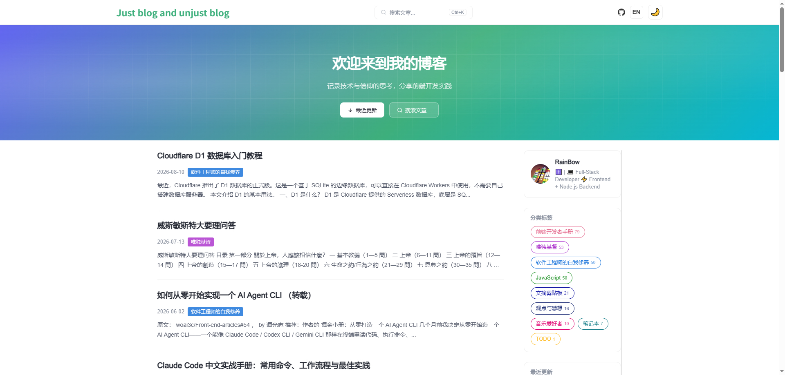
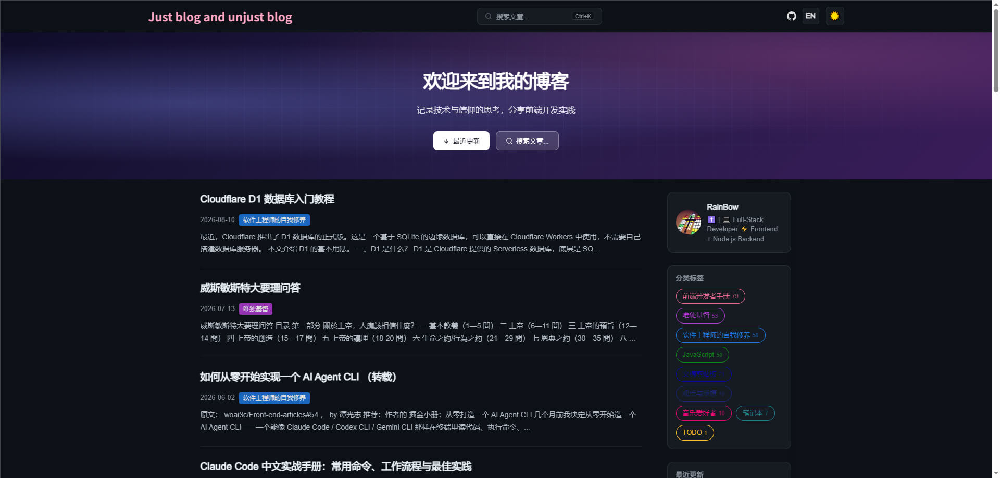

<div align="center">
  <h1>Nuxt Issue Blog</h1>
  <p>🚀 基于 GitHub Issues 和 Nuxt.js 的静态博客生成器</p>
  
  [English](./README.md) | [简体中文](./README.zh-CN.md)
  
  <p align="center">
    
    
  </p>
</div>

## ✨ 特性

- 📦 SSG 静态生成，适合 GitHub Pages；生产环境读 `posts.json`，浏览器不再直连 GitHub API
- 🌙 CSS 变量驱动的浅色/深色主题（`localStorage` 记忆）；Markdown 颜色走同一套 `--md-*` 变量
- 💬 使用 GitHub Issues 作为 CMS；文章页内 [Utterances](https://utteranc.es/) 留言，写入同一条 Issue
- 🔄 GitHub Actions 自动部署（手动触发 + 内容仓库触发）
- 🌐 中英双语
- 📱 移动端适配，响应式设计
- 🎨 渐变 Hero 首屏 + 淡网格，明暗两套配色
- 🔍 Command Palette（`Ctrl/⌘ + K`）搜索标题与正文摘要，命中词高亮，ESC 关闭
- 📝 Markdown 代码高亮 + 一键复制代码
- 🏷️ 标签云：首页按 Label 过滤文章
- 📊 文章页三栏：吸顶目录 + 正文 + 相关推荐
- ⏱️ 阅读进度条、阅读时间估算、上一篇/下一篇
- 🖼️ 图片懒加载，骨架屏与真实列表结构对齐
- 🔎 逐篇文章 SEO：`<title>`、`description`、Open Graph、Twitter 卡片取自文章标题和摘要

实现细节见 [docs/optimizations.md](./docs/optimizations.md) · [docs/comments.md](./docs/comments.md)

## 🚀 快速开始

### 环境要求

```bash
- git: ^v2.0.0
- node: >=16
- yarn: ^v1.12.0
```

### 配置 GitHub Token

1. 访问 [GitHub Token 设置页面](https://github.com/settings/tokens/new)
2. 选择以下权限：

```
read: user        读取用户信息
user: email       读取用户邮箱
```

3. 如果是组织项目，还需要：

```
read: org         读取组织信息
```

⚠️ 注意：为了账号安全，请勿选择其他权限。

### 配置项目

1. Fork 本仓库
2. 克隆到本地
3. 编辑 `blog.config.cjs`（唯一配置源；`blog.config.js` 会 re-export 并剥离 Token）：

```js
module.exports = {
  baseUrl: '/blog/',
  userName: '你的用户名',
  userEmail: '你的邮箱',
  repository: 'blog',
  // 仅构建阶段使用（nuxt.config.js / CI），不会打进前端包
  accessToken: '经过 base64 编码的 token',
  blogName: '你的博客名称',
  heroTitle: '欢迎来到我的博客',
  heroSubtitle: 'Hero 区的一句话介绍',
  seo: {
    title: '博客标题',
    description: '博客描述',
    keywords: '关键词'
  }
}
```

> Token 只在服务端 / 构建时读取（`GITHUB_TOKEN` 或 `blog.config.cjs`），公开配置里会剥掉，不会进入浏览器包。

### 开启评论（Utterances）

文章页底部可直接留言，评论会作为 GitHub Issue 评论写入内容仓库。只需一次性安装：

1. 在 **文章仓库**（`blog.config.cjs` 的 `userName/repository`）上安装 [Utterances GitHub App](https://github.com/apps/utterances)，不要装到本模板仓库。
2. 授予 Issues 读写权限。不必改配置文件。

组件用 **文章标题**（Search API）匹配 Issue。不要用 `pathname` 或 `issue-number`。访客在组件内 Sign in with GitHub。说明见 [docs/comments.md](./docs/comments.md)。

### 开发部署

```bash
# 安装依赖
yarn install

# 启动开发服务器（默认 http://localhost:9527/blog/）
yarn serve

# 构建生产版本
yarn build

# 部署到 GitHub Pages
yarn deploy
```

### 生产环境注意

- CI 需设置 `GITHUB_TOKEN`（来自 `secrets.ACCESS_TOKEN`），以便 `nuxt generate` 预渲染全部 open issues。
- 构建会写出 `/blog/data/posts.json`，供列表、搜索、标签、分页使用。
- 文章页是静态 HTML。已有评论在 generate 时写入页面。新留言走页内 Utterances（按标题走 Search API）。

## 🤝 贡献指南

1. Fork 本项目
2. 创建特性分支 (`git checkout -b feature/amazing-feature`)
3. 提交改动 (`git commit -m 'feat: add amazing feature'`)
4. 推送到分支 (`git push origin feature/amazing-feature`)
5. 提交 Pull Request

## 📝 开源协议

[MIT](./LICENSE)

## 🙏 致谢

- [Nuxt.js](https://nuxtjs.org/)
- [GitHub API](https://docs.github.com/en/rest)
- [Utterances](https://utteranc.es/)
- [Element UI](https://element.eleme.io/)
